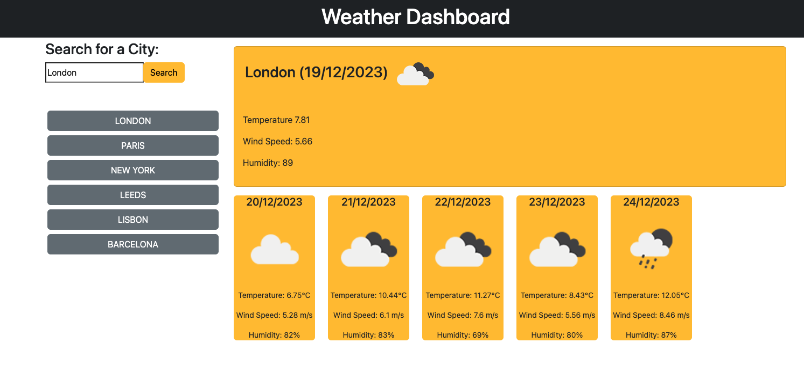

# Weather Dashboard

## Overview

Weather Dashboard is a web application that allows users to view the current and future weather conditions for multiple cities. Users can search for a city, and the application will present them with the current weather details and a 5-day forecast. The application utilizes the OpenWeather API to retrieve weather data and uses `localStorage` to store persistent data.

## Instructions
* Create a weather dashboard with form inputs.
* When a user searches for a city, they are presented with current and future conditions for that city, and that city is added to the search history.
* When a user views the current weather conditions for that city, they are presented with:
 * The city name
 * The date
 * An icon representation of weather conditions
 * The temperature
 * The humidity
 * The wind speed
* When a user views future weather conditions for that city, they are presented with a 5-day forecast that displays:
 * The date
 * An icon representation of weather conditions
 * The temperature
 * The humidity
* When a user clicks on a city in the search history, they are again presented with current and future conditions for that city.

## Technologies Used
- HTML
- CSS
- JavaScript
- jQuery
- Bootstrap
- OpenWeather API

##  Credits
Day.js: Day.js library for handling date and time.

Link to  <a href="https://github.com/D-Tsonev/weather-dashboard">Repository</a>

Link to  <a href="https://d-tsonev.github.io/Weather-Dashboard/">GitHub Page</a>

